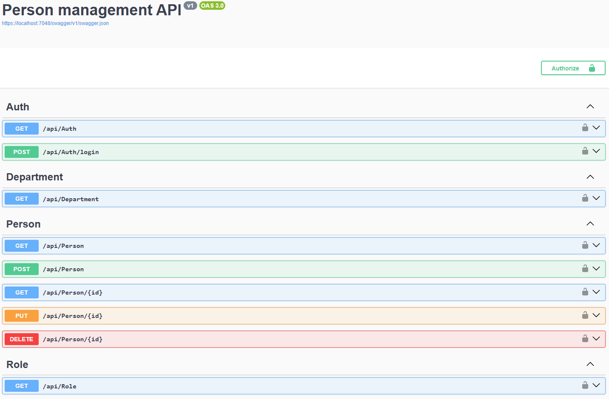

# Person Manager Application

A full-stack web application for managing person records, built with React and ASP.NET Core 8.

This project began as an implementation of the [UK Parliament's product-senior-developer-home-exercise](https://github.com/ukparliament/product-senior-developer-home-exercise), originally developed and submitted [here](https://github.com/Jacqui87/product-senior-developer-home-exercise). That version was completed within a 7-day window and included a section outlining improvements I would pursue with more time.

This repository continues that work — evolving it toward a more robust, production-ready application by turning those aspirations into implementation.

---

### 🌐 Bilingual Support (Cymorth Dwyieithog)

The application now fully supports both **English** (`en-GB`) and **Welsh** (`cy-GB`) across the entire user interface — including form labels, validation messages, error feedback, navigation items, and instructional text.

Users can choose their preferred language from a dropdown in the interface. This preference is saved and automatically applied the next time they log in, ensuring a consistent experience in their selected language.

---

## 🚀 Improvements in Progress

## ✅ Completed vs ❌ Planned Enhancements

| Feature Area                         | Description                                                                      | Status |
| ------------------------------------ | -------------------------------------------------------------------------------- | ------ |
| **Codebase Refinement**              | Extracted Role/Department logic into dedicated services and controllers.         | ✅     |
| **Targeted Testing Improvements**    | Split tests per service, modularised coverage, improved maintainability.         | ✅     |
| **Frontend Performance**             | Lazy-loaded React components with `React.lazy` and `Suspense`.                   | ✅     |
| **Bilingual UI Support**             | English and Welsh translations via `react-i18next`.                              | ✅     |
| **User Language Preference**         | Language selection UI with persistence on login.                                 | ✅     |
| **Test Coverage (Frontend/Backend)** | Expand unit tests, add edge case coverage, fix/remove 4 skipped tests.           | ❌     |
| **API Improvements**                 | Move from `PUT` to `PATCH` for partial updates.                                  | ❌     |
| **TanStack Query**                   | Add TanStack Query for improved data fetching and caching.                       | ❌     |
| **Improved UX Features**             | Clearable search, MUI Autocomplete dropdowns, profile photo upload (Azure Blob). | ❌     |
| **Security - Email Verification**    | Send email with link or code to verify updates.                                  | ❌     |
| **Bulk Operations**                  | Add bulk upload/edit support for people, departments, roles.                     | ❌     |
| **Role/Department Admin**            | Allow admin users to manage roles and departments via UI.                        | ❌     |
| **CI/CD & Tooling**                  | Set up CI/CD pipelines for automated tests, linting, deployment.                 | ❌     |
| **Refresh Token Support**            | Add refresh token handling to extend sessions without re-login.                  | ❌     |
| **End-to-End (E2E) Testing**         | Add Cypress or Playwright tests to cover key user workflows.                     | ❌     |

### ✅ Completed

#### 1. Codebase Refinement

- Extracted all **role** and **department** logic from `PersonController.cs`, `PersonService.cs`, and `personService.ts`.
- Created dedicated modules: `RoleService` and `DepartmentService` (both backend and frontend), plus `RoleController` and `DepartmentController`.
- This improves separation of concerns, simplifies testing, and prepares the codebase for scalability.

#### 2. Targeted Testing Improvements

- Separated existing tests to match new service boundaries (`PersonService`, `RoleService`, `DepartmentService`, etc.).
- Tests are now more modular, easier to navigate, and follow single-responsibility principles.
- Improves maintainability by ensuring tests target specific domain logic rather than broad controller behaviors.

#### 3. Frontend Performance Optimisation

- Added lazy loading for top-level React components (PersonConfig, LoginPage, etc.) using React.lazy and Suspense.
- Improves initial load time and performance by deferring non-critical component loading until needed.

#### 4. English/Welsh Internationalisation (not yet configurable by a user)

- Integrated react-i18next for translation handling.
- All major UI labels, validation messages, and instructional content now available in both English and Welsh.
- Users can choose their preferred language via the UI.
- Translation keys grouped by domain (common, person_editor, search_bar, etc.) for clarity and scalability.

---

### 🛠️ Planned Enhancements

_*(Adapted and expanded from the original [“What I would do given more time to complete this task”](https://github.com/Jacqui87/product-senior-developer-home-exercise?tab=readme-ov-file#what-i-would-do-given-more-time-to-complete-this-task))*_

#### 1. **Testing Coverage (Frontend & Backend)**

- Increase test coverage and add more edge case scenarios.
- Fix or remove skipped tests (currently 4 are skipped).

#### 2. **API Improvements**

- Replace `PUT` with `PATCH` for partial updates.

#### 3. **Frontend Enhancements**

- Integrate [TanStack Query](https://tanstack.com/query) for data fetching and caching.
- Improve UX: clearable search, MUI `Autocomplete` dropdowns, and support for profile photo uploads (via Azure Blob Storage).

#### 4. **Security Enhancements**

- Add email verification for address updates (e.g., send a verification link or code to confirm changes).

#### 5. **Bulk Operations**

- Implement bulk upload/edit features for users, departments, and roles.

#### 6. **Role & Department Management**

- Expand admin functionality to manage departments and roles dynamically.

#### 7. **DevOps & Tooling**

- Set up CI/CD pipelines for automated testing, linting, and deployment.

#### 8. **Refresh Token Support**

- Add refresh tokens to extend JWT-based authentication.
- Enables seamless session renewal without forcing frequent logins.

#### 9. **End-to-End (E2E) Testing**

- Add automated UI tests using Cypress or Playwright.
- Improve confidence in production-readiness and reduce regression risk.

---

## 📸 Screenshots

### ✅ Updated Swagger API

