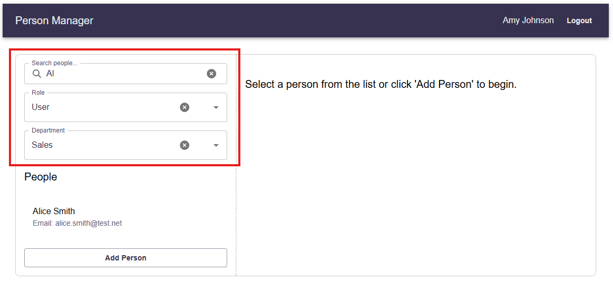
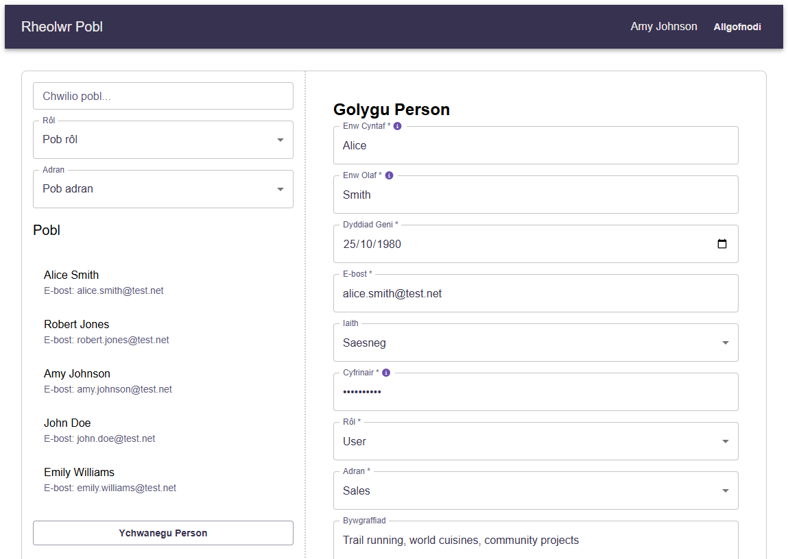

# Person Manager Application

A full-stack web application for managing person records, built with React and ASP.NET Core 8.

This project began as an implementation of the [UK Parliament's product-senior-developer-home-exercise](https://github.com/ukparliament/product-senior-developer-home-exercise), originally developed and submitted [here](https://github.com/Jacqui87/product-senior-developer-home-exercise). That version was completed within a 7-day window and included a section outlining improvements I would pursue with more time.

This repository continues that work — evolving it toward a more robust, production-ready application by turning those aspirations into implementation.

---

### 🌐 Bilingual Support (Cymorth Dwyieithog)

The application fully supports both **English** (`en-GB`) and **Welsh** (`cy-GB`) throughout the user interface — including form labels, validation messages, error feedback, navigation, and instructional text.

Users can choose their preferred language from a dropdown in the interface. This preference is saved and automatically applied the next time they log in, ensuring a consistent experience in their selected language.

---

## 🚀 Improvements Overview

## ✅ Completed vs ❌ Planned Enhancements

| Feature Area                         | Description                                                              | Status |
| ------------------------------------ | ------------------------------------------------------------------------ | ------ |
| **Codebase Refinement**              | Extracted Role/Department logic into dedicated services and controllers. | ✅     |
| **Targeted Testing Improvements**    | Split tests per service, modularised coverage, improved maintainability. | ✅     |
| **Frontend Performance**             | Lazy-loaded React components with `React.lazy` and `Suspense`.           | ✅     |
| **Bilingual UI Support**             | English and Welsh translations via `react-i18next`.                      | ✅     |
| **User Language Preference**         | Language selection UI with persistence on login.                         | ✅     |
| **TanStack Query**                   | Add TanStack Query for improved data fetching and caching.               | ✅     |
| **Improved UX Features**             | Clearable search and MUI Autocomplete dropdowns.                         | ✅     |
| **ESLint Integration**               | Integrated ESLint with TypeScript rules for consistency and quality.     | ✅     |
| **API Improvements**                 | Replaced PUT with PATCH for efficient partial updates using JSON Patch.  | ✅     |
| **Test Coverage (Frontend/Backend)** | Expand unit tests, add edge case coverage                                | ❌     |
| **Bulk Operations**                  | Add bulk upload/edit support for people, departments, roles.             | ❌     |
| **Role/Department Admin**            | Allow admin users to manage roles and departments via UI.                | ❌     |
| **Refresh Token Support**            | Add refresh token handling to extend sessions without re-login.          | ❌     |
| **End-to-End (E2E) Testing**         | Add Cypress or Playwright tests to cover key user workflows.             | ❌     |
| **Profile Photo Upload**             | Support uploading profile photos via Azure Blob Storage integration.     | ❌     |
| **Security - Email Verification**    | Send email with link or code to verify updates.                          | ❌     |
| **CI/CD & Tooling**                  | Set up CI/CD pipelines for automated tests, linting, deployment.         | ❌     |

### ✅ Completed

#### 1. Codebase Refinement

Separated role and department logic into dedicated backend and frontend modules, enhancing modularity, easing testing, and improving scalability.

#### 2. Targeted Testing Improvements

Reorganized tests by service boundaries to increase modularity and maintainability, focusing on specific domain logic.

#### 3. Frontend Performance Optimisation

Implemented lazy loading for React components and integrated TanStack Query to optimize data fetching, caching, and reduce initial load times.

#### 4. English/Welsh Internationalisation

Added bilingual UI support with react-i18next, enabling users to select their language with well-structured translation keys.

#### 5. Clearable Search & Autocomplete Dropdowns

Improved filter UI by adding clearable inputs and MUI Autocomplete components for roles and departments, enhancing UX and accessibility.

#### 6. ESLint Integration

Configured ESLint with TypeScript rules to enforce code quality, providing better developer feedback during development.

#### 7. API Improvements

Updated backend API to use PATCH with JSON Patch for partial updates instead of PUT, sending minimal change payloads. Frontend was adapted to generate and send JSON Patch documents with proper headers, improving efficiency and accurately reflecting partial updates.

---

### 🛠️ Planned Enhancements

_*(Adapted and expanded from the original [“What I would do given more time to complete this task”](https://github.com/Jacqui87/product-senior-developer-home-exercise?tab=readme-ov-file#what-i-would-do-given-more-time-to-complete-this-task))*_

#### 1. **Testing Coverage (Frontend & Backend)**

- Increase test coverage and add more edge case scenarios.

#### 2. **Bulk Operations**

- Implement bulk upload/edit features for users, departments, and roles.

#### 3. **Role & Department Management**

- Expand admin functionality to manage departments and roles dynamically.

#### 4. **Refresh Token Support**

- Add refresh tokens to extend JWT-based authentication.
- Enables seamless session renewal without forcing frequent logins.

#### 5. **End-to-End (E2E) Testing**

- Add automated UI tests using Cypress or Playwright.
- Improve confidence in production-readiness and reduce regression risk.

---

### 🛠️ Improvements Considered but Not Included in This Repository

_*(Taken from the original [“What I would do given more time to complete this task”](https://github.com/Jacqui87/product-senior-developer-home-exercise?tab=readme-ov-file#what-i-would-do-given-more-time-to-complete-this-task). These additional improvements highlight important features and tooling necessary for a reliable, maintainable, and secure production deployment. They are outside the scope of this repository and thus have not been implemented here.)*_

#### 1. **Frontend Enhancements**

- Implement profile photo upload functionality using Azure Blob Storage for scalable image management.

#### 2. **Security Enhancements**

- Add email verification for address updates to improve security and trust by confirming user identity before changes take effect.

#### 3. **DevOps & Tooling**

- Set up CI/CD pipelines for automated testing, and deployment.

---

## 📸 Screenshots

### ✅ Improved search UI

### ✅ Updated Swagger API

### ✅ UI available in Welsh - includes a language drop-down which is automatically applied the next time they log in.

