# Person Manager Application

A full-stack web application for managing person records with React and ASP.NET Core 8.

This app supports secure user authentication and role-based access control. Admin users can manage all person records; regular users can view and update their own profiles. Features include validation, filtering, department and role management, and a responsive UI.

This project originated from the [UK Parliament's product-senior-developer-home-exercise](https://github.com/ukparliament/product-senior-developer-home-exercise) and has been extended toward a production-ready application.

# Key Features and Extensions

1. JWT-based authentication and authorization with role-based access control (Admins vs Users)

2. Search and filtering of person records with responsive UI (Material UI)

3. Department and role management (add new departments/roles to backend in memory database currently)

4. Validations:

   - Frontend validation (Formik + Yup)
   - Backend validation (FluentValidation)

5. RESTful API built with ASP.NET Core 8

6. Frontend API calls via Axios

7. Inline error display for UX clarity

8. Maintainable and scalable code architecture based on SOLID principles

9. Secure authentication using JWT bearer tokens

# Table of Contents

- [Tech Stack](#tech-stack)
- [Authentication and Login](#authentication-and-Login)
- [Getting Started](#getting-started)
- [Running and Debugging](#running-and-debugging)
- [API Documentation and Usage](#api-documentation-and-usage)
- [Performance Testing plus Lighthouse Audit](#performance-testing-plus-lighthouse-audit)
- [Frontend Code Coverage](#frontend-code-coverage)
- [Code Quality and Architecture](#code-quality-and-architecture)
- [What I would do given more time to complete this task](#what-i-would-do-given-more-time-to-complete-this-task)
- [API Schema Descriptions](#api-schema-dDescriptions)
- [Request and Response Examples](#request-and-response-examples)
- [Architecture Diagram](#architecture-diagram)
- [Screenshots](#screenshots)

# Tech Stack

| Layer             | Technologies                                                   |
| ----------------- | -------------------------------------------------------------- |
| Frontend          | React, TypeScript, Material UI, Axios, Vite, Formik/Yup        |
| Backend           | ASP.NET Core 8, C#, Entity Framework Core (In-Memory provider) |
| Authentication    | JWT Bearer Tokens                                              |
| Validation        | Yup (frontend), FluentValidation (backend)                     |
| Development Tools | Visual Studio Code, .NET CLI, npm/yarn                         |

# Getting Started

### Prerequisites

- .NET 8 SDK
- Node.js (latest LTS recommended) and npm or yarn
- Visual Studio Code or preferred IDE

### Prerequisites

1.  Clone the repository.
2.  **Backend:**

    - Navigate to the root (where the `.sln` file is located).
    - Run `dotnet build` to build the backend.
    - Run `dotnet run --project UKParliament.CodeTest.Web` to start the backend API - API runs on default port 7048 (https://localhost:7048).

3.  **Frontend:**

    - Open a new terminal window.
    - Navigate to UKParliament.CodeTest.Web\ClientApp.
    - Run `npm install` (or `yarn install`) to install dependencies.
    - Run `npm run dev` to start the frontend development server (usually http://localhost:3000).

# Authentication and Login

You can log in to the Person Manager Application using one of the seeded user accounts or by creating a new user with a valid email and password. If there is a problem with logging in, please clean out the local storage using the application tab in Dev tools before trying again.

### Default Seeded Users for Login

| Email                   | Password     | Role  |
| ----------------------- | ------------ | ----- |
| alice.smith@test.net    | Password1!   | User  |
| robert.jones@test.net   | SecurePass2@ | User  |
| amy.johnson@test.net    | AdminPass3#  | Admin |
| john.doe@test.net       | UserPass4$   | User  |
| emily.williams@test.net | EmilyPwd5%   | Admin |

### Logging in via API - Swagger: `https://localhost:7048/swagger/index.html`:

Send a `POST` request to the login endpoint with your email address and password in the request body:

```
POST /api/auth/login
Content-Type: application/json

{
  "email": "amy.johnson@test.net",
  "password": "AdminPass3#"
}
```

A successful login will return a JSON Web Token (JWT) which you should use as a Bearer token in the Authorization header for subsequent API requests.

Example of a successful response:

```
{
  "token": "eyJhbGciOiJIUzI1NiIsInR5cCI6IkpXVCJ9...",
  "expiresIn": 3600,
  "user": {
    "id": 3,
    "email": "amy.johnson@test.net",
    "role": 2
  }
}
```

Use the token returned to authenticate your requests in the top of the Swagger API.

# Running and Debugging

### Backend (ASP.NET Core)

- Open the solution in Visual Studio or Visual Studio Code.
- Set breakpoints as needed in C# code.
- Use `F5` or the Debug button to start debugging.
- In VS Code, configure `launch.json` for debugging with breakpoints.

### Frontend (React with Vite and TypeScript)

- Start the dev server with `npm run dev`.
- Use browser devtools and React Developer Tools for debugging.
- Optional: Set breakpoints and debug inside VS Code with `launch.json`.

### Compound Debugging (Backend + Frontend)

Use this configuration snippet in .vscode/launch.json to debug both simultaneously:

```
{
    "version": "0.2.0",
    "configurations": [
        {
            "name": ".NET Core Launch (backend)",
            "type": "coreclr",
            "request": "launch",
            "preLaunchTask": "build",
            "program": "${workspaceFolder}/bin/Debug/net8.0/YourBackendApp.dll",
            "args": [],
            "cwd": "${workspaceFolder}",
            "stopAtEntry": false,
            "serverReadyAction": {
                "action": "openExternally",
                "pattern": "\bNow listening on:\s+(https?://\S+)"
            },
            "env": {
                "ASPNETCORE_ENVIRONMENT": "Development"
            },
            "sourceFileMap": {
                "/Views": "${workspaceFolder}/Views"
            }
        }
    ]
}
```

# API Documentation and Usage

- API endpoints are documented and testable via **Swagger UI** at `https://localhost:7048/swagger/index.html` (available in Development mode).
- Use Postman or similar tools for manual testing.

### Person DTO Schema

```json
{
  "id": 1,
  "firstName": "string",
  "lastName": "string",
  "role": 2,
  "email": "string",
  "password": "string",
  "biography": "string (optional)",
  "department": 3,
  "dateOfBirth": "YYYY-MM-DD"
}
```

### Example API Endpoints

- Get All Persons

  **GET** /api/person

- Get Person by ID

  **GET** /api/person/{id}

- Create Person

  **POST** /api/person

  Body similar to Person DTO but without id.

- Update Person

  **PUT** /api/person/{id}

## Example cURL Command to Get All Persons

```bash
curl -H "Authorization: Bearer <JWT_TOKEN>" https://localhost:7048/api/person
```

# Performance Testing plus Lighthouse Audit

The frontend production build was audited with `https://developers.google.com/web/tools/lighthouse` yielding:

| Category       | Score |
| -------------- | ----- |
| Performance    | 86    |
| Accessibility  | 98    |
| Best Practices | 93    |
| SEO            | 91    |

These results demonstrate strong readiness for production deployment.

# Frontend Code Coverage

Used the V8 code coverage tool to verify React frontend test coverage via Chrome's V8 engine using `npm run coverage`. The latest results indicate that MainPage.tsx, UserConfig.tsx, PersonEditor.tsx, personService.ts, and mainPageReducer.ts require more testing

# Code Quality and Architecture

- Based on SOLID principles and separation of concerns.
- Frontend uses functional components and hooks.
- Responsive design with Material UI.
- Backend input validated with FluentValidation.
- JWT tokens secure authentication.
- Inline validation messages improve user feedback.
- As per the original project - the backend uses Entity Framework Core with the In-Memory database provider to handle data persistence and querying, enabling a maintainable and test-friendly data access layer without the need for a physical database

# What I would do given more time to complete this task

1. Testing coverage frontend & backend:

   - Increase coverage and add more tests dealing with edge cases.
   - Fix or remove skipped tests - there are currently 4 skipped tests.

2. API Improvements:

   - Move from PUT to PATCH for partial updates.

3. Frontend Enhancements:

   - Use TanStack Query for data fetching/caching, for example in the personService.ts.
   - Add i18n support for accessibility and wider reach (e.g. Welsh/English support).
   - Improve UX with features like clearable search, better dropdowns (MUI AutoComplete), and profile photo support (using Azure Blob Storage).

4. Security:

   - Add email verification for updates with an email to the updated address with either a link to click on or a verification code to verify the change.

5. Bulk Operations:

   - Add bulk upload/edit for users, departments, and roles.

6. Department and Role Management:

   - Implement a department and role management system

7. DevOps & Tooling:

   - Research how to add CI/CD pipelines for automated testing, linting, and deployment.

8. Implement refresh token support:

   - Add refresh tokens to complement JWT access tokens, allowing the frontend to renew sessions transparently.
   - This would ensure that the current logged-in user is continuously validated and still authorized to access the application.
   - It would prevent stale or invalid sessions by requiring periodic revalidation without forcing users to frequently log in again.

9. Add end-to-end (E2E) testing:
   - Implement automated UI tests using a tool like Cypress or Playwright to cover critical user journeys.
   - Ensure comprehensive test coverage beyond unit and integration tests to validate application workflows from the user perspective.
   - This would improve confidence in production readiness and reduce regression risks.

---

# Architecture Diagram

```
+--------------------------------------+
|              Frontend                |
|--------------------------------------|
| React (TypeScript, MUI, Formik/Yup)  |
+--------------------+-----------------+
                     |
                     |  REST API (HTTPS)
                     v
+--------------------+-----------------+
|              Backend                 |
|--------------------------------------|
| ASP.NET Core 8 API                   |
| FluentValidation, JWT Auth           |
| Entity Framework Core (In-Memory DB) |
+--------------------+-----------------+
                     |
                     |  LINQ Queries via EF Core
                     v
+--------------------+-----------------+
|             Database                 |
|--------------------------------------|
|         In memory database           |
+--------------------------------------+
```

---

# Screenshots

- Login form

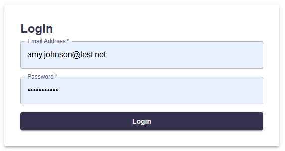

- Searching and filtering options

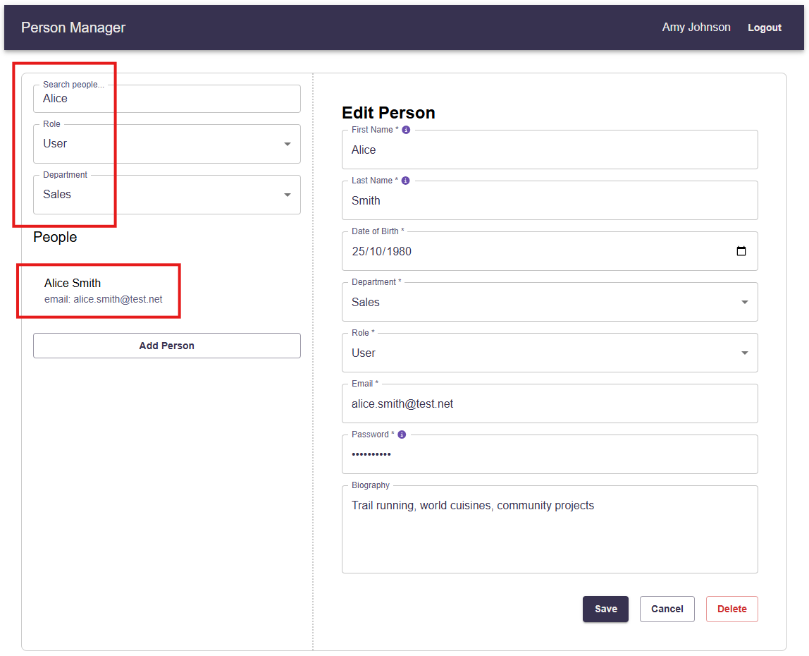

- Edit person form

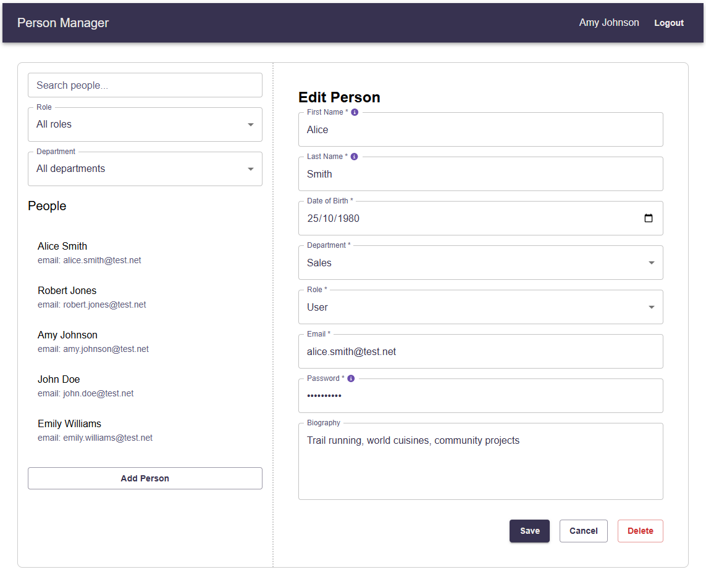

- Add person form

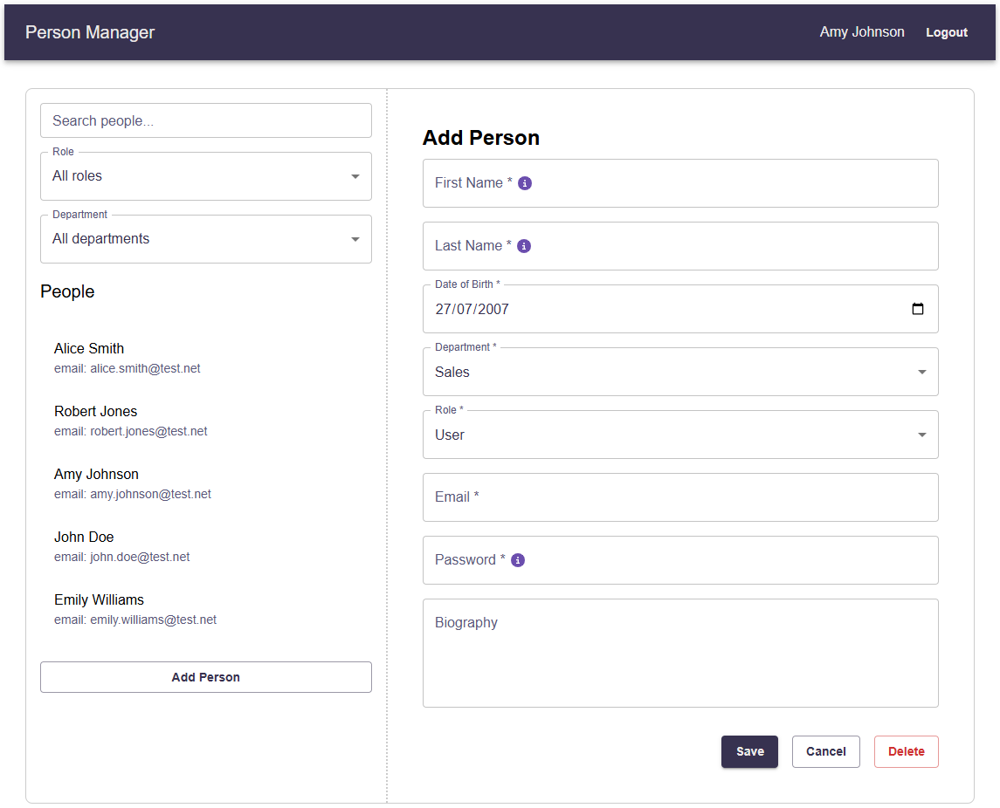

- Client side validation using formik/yup

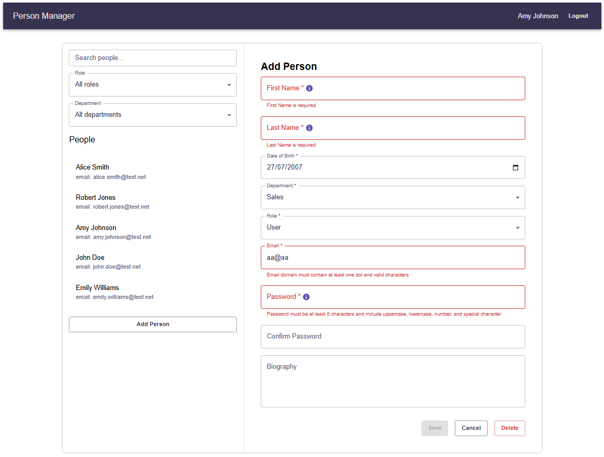

- No one can delete themselves but admins can delete other people

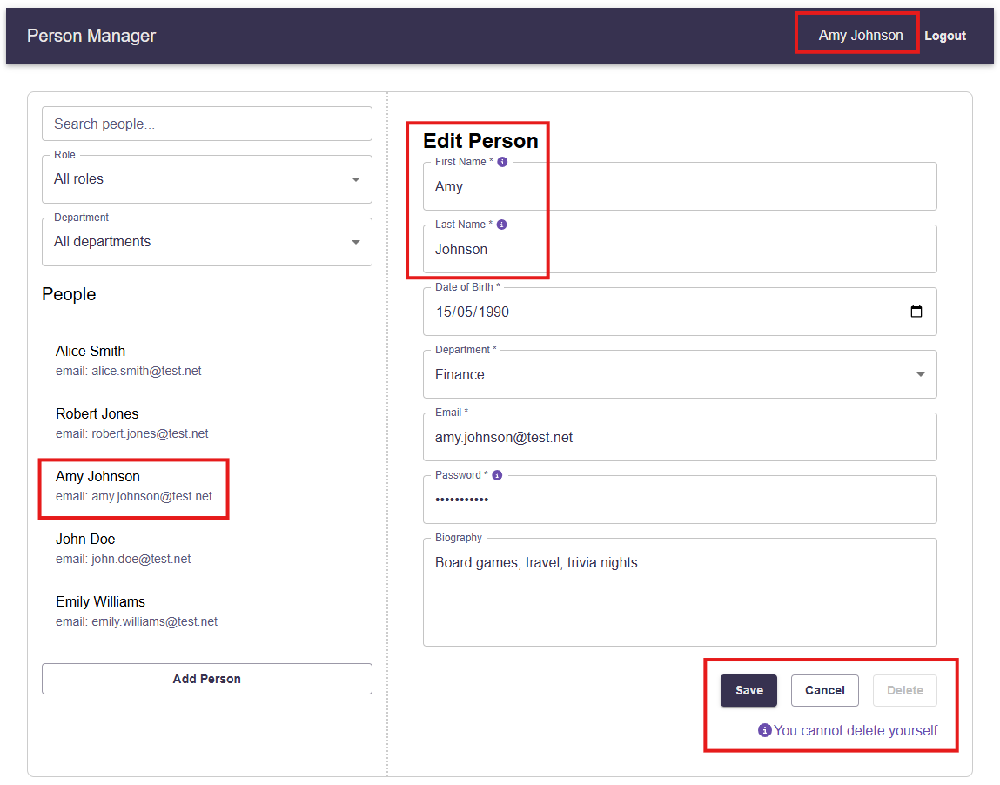

- User only login as opposed to an admin login

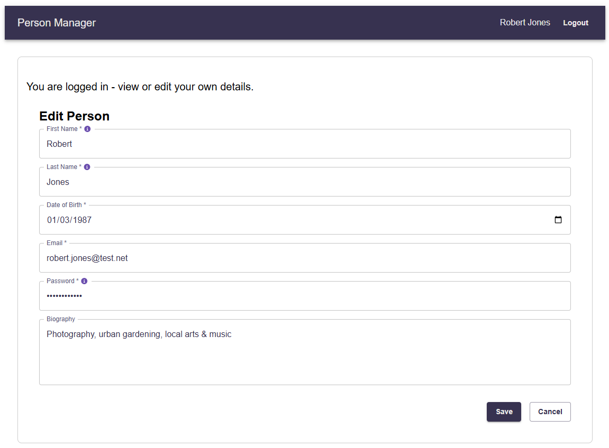

- Success snackbar when add/update had been successful

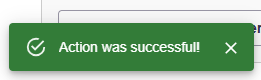

- Information snackbar notifying a user they have cancelled their add/update changes

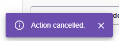

- Mobile friendly layout

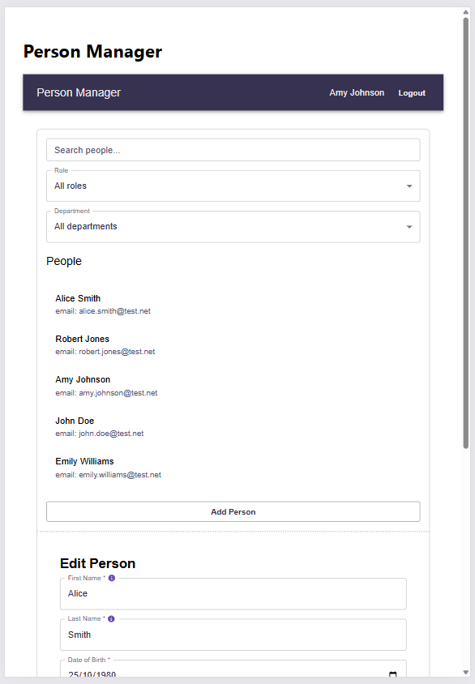

- JWT token example: navigate to [https://www.jwt.io/](https://www.jwt.io/) & paste in the token

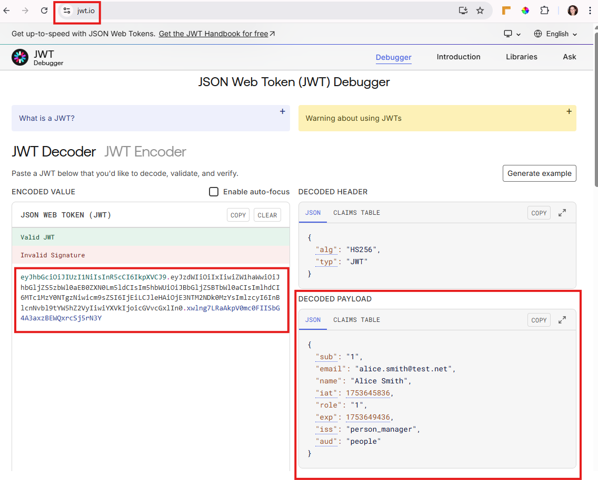
